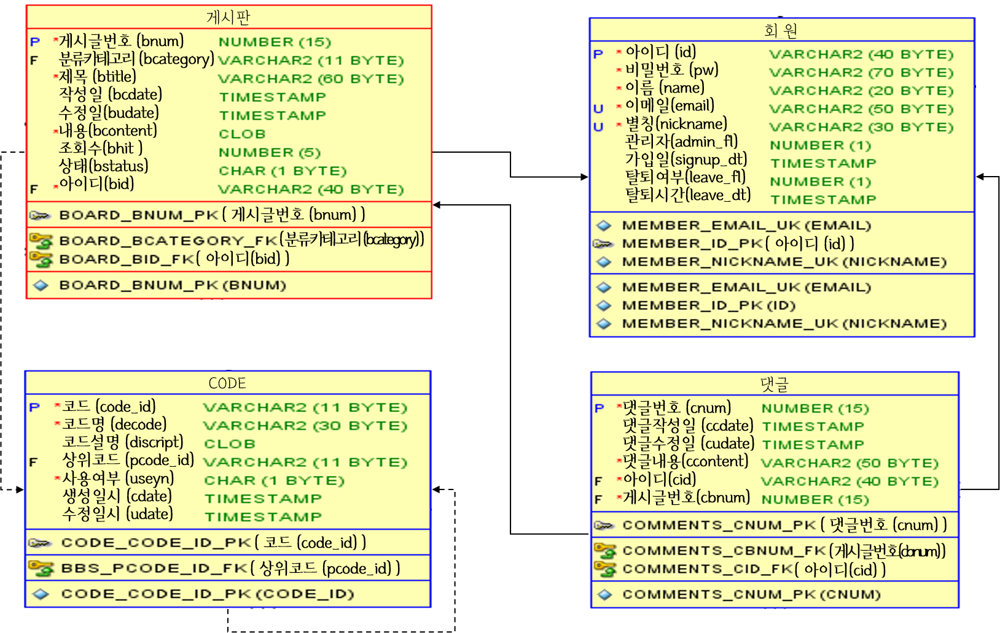

## 리ː플(readingːfly)
>도서 검색 및 독서 기록 서비스 
데모 영상 : [https://youtu.be/nhItIg3HmSg](https://youtu.be/nhItIg3HmSg)

   

## 1. 제작 기간 & 제작 인원
- 1월 1주차 ~ 3월 1주차 : 프로젝트 기획 및 설계
- 2월 4주차 ~ <s>3월 5주차(계획)</s> 4월 2주차(지연) : 구현
- 3월 5주차 ~ <s>4월 1주차(계획)</s> 4월 2주차(지연) : 테스트
- 팀프로젝트(참여인원 5인)

   

## 2. 담당 파트
- 게시판 : 게시글 CRUD, 파일 첨부, CKEditor
- 댓글 : 댓글 CRUD
- 도서 리뷰 : 리뷰 등록, 별점 등록
- 기타 구현 총괄 : 지도, 책장, 독서기록, 달력에 관여

   

## 3. 담당 파트에서 사용한 기술
**`Back-end`** 
Java11 
Spring Boot 2.6.3 
Spring Framework 5.3 
Gradle 
oracle 18c XE 

**`Front-end`** 
CKEditor 
Font-Awesome

**`test`** 
Junit5 
Postman

**`형상관리`** 
Git 
GitHub 

   

## 4. ERD 설계
