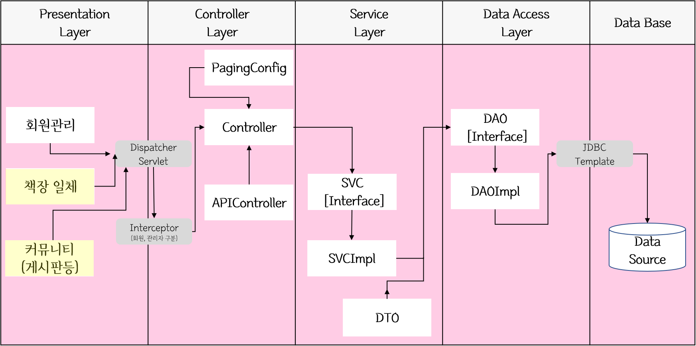
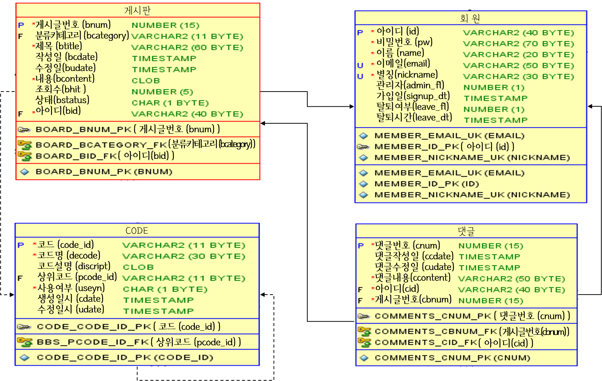

# 리ː플(readingːfly)

>도서 검색 및 독서 기록 서비스
><br>데모 영상 : [https://youtu.be/nhItIg3HmSg](https://youtu.be/nhItIg3HmSg){:target="_blank"}
><br>프로젝트 전체 개요를 보고 싶다면 [프로젝트 개요.pdf](https://jeon1787.github.io/assets/220413%202%EC%A1%B0_%ED%94%84%EB%A1%9C%EC%A0%9D%ED%8A%B8_%EB%B0%9C%ED%91%9C.pdf){:target="_blank"}
><br><br>!해당 README.md 문서는 전체 프로젝트 설명 목적이 아닌 담당 파트 설명을 목적으로 작성했습니다.

## 목차
1. [제작 기간 & 제작 인원](#1.-제작-기간-&-제작-인원)
2. [담당 파트](#2.-담당-파트)
3. [사용 기술](#3.-사용-기술)
4. [아키텍처](#4.-아키텍처)
5. [게시판 ERD 설계](#5.-게시판-ERD-설계)
6. [주요 Query](#6.-주요-Query)
7. [주요 Javascript](#7.-주요-Javascript)
8. [테스트](#8.-테스트))

<br><br><br>

## 1. 제작 기간 & 제작 인원
- 1월 1주차 ~ 3월 1주차 : 프로젝트 기획 및 설계
- 2월 4주차 ~ <s>3월 5주차(계획)</s> 4월 2주차(지연) : 구현
- 3월 5주차 ~ <s>4월 1주차(계획)</s> 4월 2주차(지연) : 테스트
- 팀프로젝트(참여인원 5인)

<br><br><br>

## 2. 담당 파트
- 게시판 : 게시글 CRUD, 파일 첨부, CKEditor
- 댓글 : 댓글 CRUD
- 도서 리뷰 : 리뷰 등록, 별점 등록
- 기타 구현 총괄 : 지도, 책장, 독서기록, 달력에 관여

<br><br><br>

## 3. 사용 기술
**`Back-end`**<br>
Java11<br>
Spring Boot 2.6.3<br>
Spring Framework 5.3<br>
Gradle<br>
oracle 18c XE<br>

**`Front-end`**<br>
CKEditor<br>
Font-Awesome

**`test`**<br>
Junit5<br>
Postman

**`형상관리`**<br>
Git<br>
GitHub<br>

<br><br><br>

## 4. 아키텍처

<details>
<summary>아키텍처 보기</summary>



</details>

<br><br><br>

## 5. 게시판 ERD 설계


<br><br><br>

## 6. 주요 Query

<br>

### 6.1 게시글 목록 조회
```
select t1.*
from (
    select
        row_number() over (order by bcdate desc) as num,
        게시글번호, 제목, 작성일, 수정일, 조회수, 별칭, nvl(cnt, 0) as cnt
    from
        게시판테이블
        inner join 회원테이블
        on 게시판테이블.회원아이디 = 회원테이블.회원아이디
        left outer join (
            select 게시글번호, count(*) as cnt
            from 댓글테이블
            group by 게시글번호
        ) t2
        on 게시판테이블.게시글번호 = t2.게시글번호
        (검색조건 추가 위치)
) t1
where t1.num between ?1 and ?2

※?1 : select 결과 중 목록으로 보여줄 row의 첫 행
  ?2 : select 결과 중 목록으로 보여줄 row의 마지막 행
```
게시판테이블, 회원테이블, 게시글별 댓글 개수 집계함수(count(*)) 테이블(이하 댓글수테이블)을 join했습니다.
회원아이디가 필수인 게시판테이블과 회원테이블은 inner join, 댓글수테이블은 left outer join으로 join했습니다.
group by와 count(*)로 게시글별 댓글 개수를 집계 후 nvl(cnt, 0)로 댓글이 없어 null인 cnt 값은 0으로 변환하였습니다.
<br><br>
검색조건 추가시 (검색조건 추가 위치)에 검색 조건에 따라 `제목 like '%검색어%'`나 `dbms_lob.instr(게시판테이블.내용, '검색어') > 0`, `별칭 like '%검색어%'`를 추가했습니다.

<br>

### 6.2 게시글 CRUD

- 조회
```
select 게시글번호, 제목, 작성일, 수정일, 내용, 조회수, 회원아이디, 별칭
from 게시판테이블, 회원테이블
where 게시판테이블.회원아이디 = 회원테이블.회원아이디 and 게시글번호 = ?

※? : 조회할 게시글번호 
```

- 등록
```
insert into 게시판테이블 (게시글번호, 카테고리, 제목, 내용, 회원아이디)
values (board_bnum_seq.nextval, 'C0101', ?, ?, ?)

※board_bnum_seq : 게시판번호 시퀀스
  C0101 : 게시판 코드
```

- 수정
```
update 게시판테이블
set 제목 = ? ,
    내용 = ? ,
    수정일 = systimestamp
where 게시글번호 = ? and 회원아이디 = ?
```

- 삭제
```
delete from 게시판테이블
where 게시글번호 = ? and 회원아이디 = ?
```

</details>

<br><br><br>

## 7. 주요 Javascript

- 게시글 등록 js 및 작성중 페이지 이동 방지 js
https://github.com/jeon1787/reading_fly/blob/ebc0ea843746bf7d55bb098cca317f10df96864e/src/main/resources/static/js/board/addForm.js#L65-L106

<br>

이벤트 캡쳐링(Capturing) 단계에서는(`document.body.addEventListener('click', e=>{}, true)`)
뒤로가기 버튼 등 html을 새로 요청하는 경우 `confirm("작성을 종료하시겠습니까?")`창을 띄우고
이벤트 버블링(Bubbling) 단계에서는 게시글 등록 버튼(`addBtn.addEventListener('click', e=>{})`)과
게시판 목록 이동 버튼(`listBtn.addEventListener('click', e=>{})`)이 기능하도록 작성하였습니다.

<br><br><br>

## 8. 테스트

<br>

### 8.1 Postman


<br>
댓글과 리뷰는 rest API로 제작하였습니다.
<br>
<details>
<summary>기타 postman 테스트 보기</summary>


</details>

<br>

### 8.2 Junit
